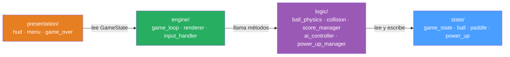

# Arquitectura del proyecto — Atari Pong

## Filosofía de diseño

El sistema se organiza en **cuatro capas con dependencias unidireccionales**: cada capa solo conoce a la capa inmediatamente inferior. La capa de Estado no importa nada del resto del sistema. Esto garantiza que se puede cambiar el motor de renderizado, la física o la presentación sin tocar las demás capas.

Principios aplicados: **SOLID**, **SRP**, **SoC** (Separation of Concerns), **DRY** con la regla de tres, **KISS**, **YAGNI**.

---

## Estructura de carpetas

```
pong/
│
├── main.py                    # Punto de entrada: instancia GameLoop y lo arranca
├── constants.py               # Todas las constantes del juego (sin magic numbers)
│
├── state/                     # Capa 4 — Estado del juego (datos puros, sin lógica)
│   ├── __init__.py
│   ├── game_state.py          # Enum GameStatus + dataclass con el estado global
│   ├── ball.py                # Dataclass Ball: posición, velocidad, tamaño
│   ├── paddle.py              # Dataclass Paddle: posición, tamaño, jugador
│   └── power_up.py            # Dataclass PowerUp: tipo, posición, duración restante
│
├── logic/                     # Capa 3 — Lógica del juego (reglas, física, IA)
│   ├── __init__.py
│   ├── ball_physics.py        # Mueve la pelota, aplica velocidad incremental
│   ├── collision.py           # Motor AABB: detecta y resuelve colisiones
│   ├── score_manager.py       # Lleva el puntaje, detecta fin de partida
│   ├── ai_controller.py       # Calcula el movimiento de la paleta de la IA
│   └── power_up_manager.py    # Genera power-ups, gestiona efectos y duraciones
│
├── engine/                    # Capa 2 — Motor del juego (loop, render, input)
│   ├── __init__.py
│   ├── game_loop.py           # Loop principal a 60 FPS, orquesta todo
│   ├── renderer.py            # Dibuja cada fotograma en el canvas pygame
│   └── input_handler.py       # Abstrae la entrada de teclado por jugador
│
└── presentation/              # Capa 1 — Presentación (pantallas y HUD)
    ├── __init__.py
    ├── hud.py                 # Marcador en pantalla + indicador de power-up activo
    ├── menu.py                # Pantalla de inicio y selección de modo (1P / 2P)
    └── game_over_screen.py    # Pantalla de fin de partida con ganador y opciones
```

---

## Descripción de capas

### Capa 4 — Estado del juego (`state/`)
**Responsabilidad:** almacenar los datos del juego sin procesarlos.

- No contiene lógica de negocio.
- Usa `dataclasses` de Python: son mutables, con tipos explícitos y sin dependencias externas.
- Cualquier otra capa puede leer el estado, pero solo la Capa 3 lo modifica.

```python
# state/ball.py
from dataclasses import dataclass

@dataclass
class Ball:
    x: float
    y: float
    vx: float
    vy: float
    radius: int
```

```python
# state/game_state.py
from enum import Enum, auto
from dataclasses import dataclass, field
from state.ball import Ball
from state.paddle import Paddle
from state.power_up import PowerUp

class GameStatus(Enum):
    MENU = auto()
    MODE_SELECTION = auto()
    PLAYING = auto()
    PAUSED = auto()
    GAME_OVER = auto()

@dataclass
class GameState:
    status: GameStatus = GameStatus.MENU
    ball: Ball = field(default_factory=Ball.create_default)
    paddle_left: Paddle = field(default_factory=lambda: Paddle.create_left())
    paddle_right: Paddle = field(default_factory=lambda: Paddle.create_right())
    score_left: int = 0
    score_right: int = 0
    active_power_up: PowerUp | None = None
    two_player_mode: bool = False
```

---

### Capa 3 — Lógica del juego (`logic/`)
**Responsabilidad:** implementar las reglas del juego. No sabe nada de pygame ni de cómo se dibuja nada.

Cada módulo tiene una sola responsabilidad (SRP):

| Módulo | Responsabilidad única |
|---|---|
| `ball_physics.py` | Mover la pelota cada frame; aplicar +5% de velocidad tras rebote en paleta |
| `collision.py` | Detectar colisiones AABB y devolver el tipo de colisión ocurrida |
| `score_manager.py` | Actualizar puntaje cuando la pelota sale; detectar ganador al llegar a 5 |
| `ai_controller.py` | Calcular la dirección de movimiento de la paleta derecha en modo 1P |
| `power_up_manager.py` | Decidir cuándo y dónde aparece un power-up; aplicar/revertir sus efectos |

**Ejemplo — ángulo de rebote variable (Feature 4):**
```python
# logic/collision.py
def calculate_bounce_angle(ball_y: float, paddle: Paddle) -> float:
    relative_impact = (ball_y - paddle.y) / paddle.height  # 0.0 a 1.0
    normalized = relative_impact - 0.5                     # -0.5 a 0.5
    return normalized * MAX_BOUNCE_ANGLE                   # e.g. ±75 grados
```

**OCP para power-ups (Feature 2):** se usa una clase base abstracta para que agregar un nuevo tipo no modifique el código existente.

```python
# logic/power_up_manager.py
from abc import ABC, abstractmethod
from state.paddle import Paddle

class PowerUpEffect(ABC):
    @abstractmethod
    def apply(self, paddle: Paddle) -> None: ...

    @abstractmethod
    def revert(self, paddle: Paddle) -> None: ...

class GrowPaddleEffect(PowerUpEffect):
    def apply(self, paddle: Paddle) -> None:
        paddle.height = int(paddle.height * 1.5)

    def revert(self, paddle: Paddle) -> None:
        paddle.height = int(paddle.height / 1.5)

class ShrinkPaddleEffect(PowerUpEffect):
    def apply(self, paddle: Paddle) -> None:
        paddle.height = int(paddle.height * 0.67)

    def revert(self, paddle: Paddle) -> None:
        paddle.height = int(paddle.height / 0.67)
```

---

### Capa 2 — Motor del juego (`engine/`)
**Responsabilidad:** coordinar el ciclo a 60 FPS, delegar la lógica a la Capa 3 y la visualización a la Capa 1.

`GameLoop` es el orquestador. No contiene lógica de juego — la delega.

```
GameLoop._update()  →  llama a BallPhysics, CollisionEngine, ScoreManager, PowerUpManager
GameLoop._render()  →  llama a Renderer y HUD
GameLoop._handle_input()  →  llama a InputHandler
```

**DIP — Inversión de dependencias:** `GameLoop` depende de protocolos/interfaces, no de implementaciones concretas. Así se puede inyectar un `AIController` o un `PlayerInputHandler` según el modo de juego.

```python
# engine/input_handler.py
from typing import Protocol
from state.paddle import Paddle

class InputHandler(Protocol):
    def get_direction(self) -> int:
        """Retorna -1 (arriba), 0 (quieto) o 1 (abajo)."""
        ...

class PlayerInputHandler:
    def __init__(self, key_up: int, key_down: int): ...
    def get_direction(self) -> int: ...

class AIInputHandler:
    def __init__(self, ai_controller): ...
    def get_direction(self) -> int: ...
```

---

### Capa 1 — Presentación (`presentation/`)
**Responsabilidad:** mostrar información visual al jugador. No tiene lógica de negocio.

Cada módulo dibuja una pantalla o elemento de UI leyendo el estado como entrada:

```python
# presentation/hud.py
class HUD:
    def draw(self, surface, state: GameState) -> None:
        # dibuja puntaje y power-up activo, sin modificar el estado
        ...
```

---

## Diagrama de dependencias entre capas



**Regla de oro:** ningún módulo de una capa puede importar desde una capa superior.  
`state/` nunca importa de `logic/` ni de `engine/`. `logic/` nunca importa de `engine/`.

---

## Constants — sin magic numbers

Toda constante del juego vive en `constants.py`:

```python
# constants.py
SCREEN_WIDTH  = 800
SCREEN_HEIGHT = 600
FPS           = 60

BALL_RADIUS      = 8
BALL_BASE_SPEED  = 5.0
BALL_SPEED_INCREMENT = 0.05   # +5% por rebote en paleta

PADDLE_WIDTH   = 12
PADDLE_HEIGHT  = 80
PADDLE_SPEED   = 6
AI_SPEED       = 4

MAX_BOUNCE_ANGLE  = 75        # grados máximos de desviación
WINNING_SCORE     = 5

POWER_UP_DURATION     = 10    # segundos
POWER_UP_SPAWN_EVERY  = 15    # segundos entre apariciones
GROW_FACTOR           = 1.5
SHRINK_FACTOR         = 0.67
```

---

## Checklist SOLID por capa

| Principio | Aplicación concreta |
|---|---|
| **S** — SRP | Cada clase en `logic/` hace exactamente una cosa (`ScoreManager` solo puntaje, `CollisionEngine` solo colisiones) |
| **O** — OCP | `PowerUpEffect` es extensible sin modificar: agregar `SpeedBoostEffect` no toca `PowerUpManager` |
| **L** — LSP | `GrowPaddleEffect` y `ShrinkPaddleEffect` son intercambiables donde se espera `PowerUpEffect` |
| **I** — ISP | `InputHandler` como Protocol tiene un único método `get_direction()` — no se obliga a implementar nada extra |
| **D** — DIP | `GameLoop` depende del Protocol `InputHandler`, no de `PlayerInputHandler` directamente; se inyecta en el constructor |
