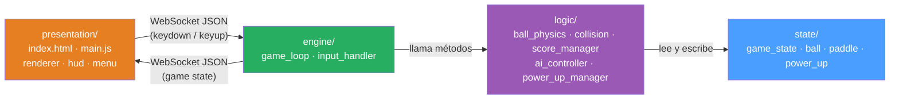

# Arquitectura del proyecto — Atari Pong

## Filosofía de diseño

El sistema se organiza en **cuatro capas con dependencias unidireccionales**: cada capa solo conoce a la capa inmediatamente inferior. La capa de Estado no importa nada del resto del sistema. Esto garantiza que se puede cambiar el motor de renderizado, la física o la presentación sin tocar las demás capas.

Principios aplicados: **SOLID**, **SRP**, **SoC** (Separation of Concerns), **DRY** con la regla de tres, **KISS**, **YAGNI**.

---

## Tecnología por capa

```
┌─────────────────────────────────────────────────────────────┐
│  Capa 1 — PRESENTACIÓN                                      │
│  HTML5 Canvas + JavaScript (ES6 modules)                    │
│  Renderiza en el navegador, NO contiene lógica de juego     │
└────────────────────┬────────────────────────────────────────┘
                     │  WebSocket JSON  (~60 fps bidireccional)
┌────────────────────▼────────────────────────────────────────┐
│  Capa 2 — MOTOR                                             │
│  Python asyncio + websockets                                │
│  Loop a 60 FPS, sirve HTTP, gestiona conexiones WS          │
└────────────────────┬────────────────────────────────────────┘
                     │  llamadas directas Python
┌────────────────────▼────────────────────────────────────────┐
│  Capa 3 — LÓGICA                                            │
│  Python puro                                                │
│  Física, AABB, puntaje, IA, power-ups                       │
└────────────────────┬────────────────────────────────────────┘
                     │  lectura / escritura
┌────────────────────▼────────────────────────────────────────┐
│  Capa 4 — ESTADO                                            │
│  Python dataclasses                                         │
│  Datos puros, zero lógica, zero imports de capas superiores │
└─────────────────────────────────────────────────────────────┘
```

---

## Estructura de carpetas

```
pong/
│
├── main.py                    # Servidor WebSocket (ws://localhost:8765)
│                              # + servidor HTTP estático (http://localhost:8080)
├── constants.py               # Todas las constantes del juego (sin magic numbers)
├── requirements.txt           # websockets>=12.0
│
├── state/                     # Capa 4 — Estado del juego (datos puros, sin lógica)
│   ├── __init__.py
│   ├── game_state.py          # Enum GameStatus + dataclass con el estado global
│   ├── ball.py                # Dataclass Ball: posición, velocidad, tamaño
│   ├── paddle.py              # Dataclass Paddle: posición, tamaño, jugador
│   └── power_up.py            # Dataclass PowerUp: tipo, posición, radio
│
├── logic/                     # Capa 3 — Lógica del juego (reglas, física, IA)
│   ├── __init__.py
│   ├── ball_physics.py        # Mueve la pelota, aplica velocidad incremental
│   ├── collision.py           # Motor AABB: detecta colisiones
│   ├── score_manager.py       # Lleva el puntaje, detecta fin de partida
│   ├── ai_controller.py       # Calcula el movimiento de la paleta de la IA
│   └── power_up_manager.py    # Genera power-ups, gestiona efectos y duraciones
│
├── engine/                    # Capa 2 — Motor del juego (loop, input, WS)
│   ├── __init__.py
│   ├── game_loop.py           # Loop a 60 FPS, serializa estado a JSON
│   └── input_handler.py      # WebInputHandler: lee teclas desde mensajes WS
│
└── presentation/              # Capa 1 — Frontend HTML5 (puro JS/Canvas)
    ├── index.html             # Entry point servido en http://localhost:8080
    ├── main.js                # Cliente WebSocket + bucle de render (rAF)
    ├── renderer.js            # Dibuja entidades en Canvas 2D
    ├── hud.js                 # Overlay de pausa
    ├── menu.js                # Pantallas de menú y selección de modo
    ├── game_over_screen.js    # Pantalla de fin de partida
    └── constants.js           # Espejo JS de las constantes de Python
```

---

## Protocolo WebSocket

### Servidor → Cliente (cada frame, ~60/s)
```json
{
  "status": "PLAYING",
  "ball":        { "x": 400, "y": 300, "radius": 8 },
  "paddleLeft":  { "x": 30,  "y": 260, "width": 12, "height": 80 },
  "paddleRight": { "x": 758, "y": 260, "width": 12, "height": 80 },
  "scoreLeft": 2,
  "scoreRight": 1,
  "powerUp": { "x": 400, "y": 300, "radius": 12, "type": "GROW" },
  "effectTimerLeft": 7.4,
  "effectTimerRight": 0,
  "winner": ""
}
```

### Cliente → Servidor (eventos de teclado)
```json
{ "type": "keydown", "code": "KeyW" }
{ "type": "keyup",   "code": "ArrowDown" }
```

---

## Descripción de capas

### Capa 4 — Estado del juego (`state/`)
**Responsabilidad:** almacenar los datos del juego sin procesarlos.

- No contiene lógica de negocio.
- Usa `dataclasses` de Python: mutables, con tipos explícitos, sin dependencias externas.
- **Ninguna capa superior puede ser importada aquí.**

```python
# state/ball.py
from dataclasses import dataclass

@dataclass
class Ball:
    x: float
    y: float
    vx: float
    vy: float
    radius: int
```

---

### Capa 3 — Lógica del juego (`logic/`)
**Responsabilidad:** implementar las reglas del juego. No sabe nada de WebSocket, HTTP ni Canvas.

| Módulo | Responsabilidad única |
|---|---|
| `ball_physics.py` | Mover la pelota; aplicar +5% velocidad tras rebote en paleta |
| `collision.py` | Detectar colisiones AABB y devolver el tipo de colisión |
| `score_manager.py` | Actualizar puntaje; detectar ganador al llegar a 5 |
| `ai_controller.py` | Calcular dirección de movimiento de la paleta derecha en modo 1P |
| `power_up_manager.py` | Decidir cuándo aparece un power-up; aplicar/revertir efectos |

**OCP para power-ups (Feature 2):** clase base abstracta → agregar un nuevo tipo no modifica el código existente.

```python
# logic/power_up_manager.py
from abc import ABC, abstractmethod

class PowerUpEffect(ABC):
    @abstractmethod
    def apply(self, paddle: Paddle) -> None: ...

    @abstractmethod
    def revert(self, paddle: Paddle) -> None: ...

class GrowPaddleEffect(PowerUpEffect):
    def apply(self, paddle):  paddle.height = int(paddle.height * 1.5)
    def revert(self, paddle): paddle.height = int(paddle.height / 1.5)
```

---

### Capa 2 — Motor del juego (`engine/`)
**Responsabilidad:** coordinar el ciclo a 60 FPS, transmitir estado via WebSocket y recibir input del cliente.

`GameLoop` es el orquestador. No contiene lógica de juego — la delega a la Capa 3.

```
GameLoop.update()   →  llama a BallPhysics, CollisionEngine, ScoreManager, PowerUpManager
GameLoop.to_dict()  →  serializa GameState a JSON para el cliente
main.py ws_handler  →  recibe keydown/keyup, llama a GameLoop.on_key_down/up()
```

**DIP — Inversión de dependencias:** `GameLoop` depende del `WebInputHandler`, que recibe un `set` de teclas como protocolo implícito. La fuente de ese set (WebSocket, teclado local, test) es irrelevante para GameLoop.

```python
# engine/input_handler.py
class WebInputHandler:
    def __init__(self, key_up: str, key_down: str, key_state: set) -> None: ...

    def get_direction(self) -> int:
        if self._key_up   in self._key_state: return -1
        if self._key_down in self._key_state: return  1
        return 0
```

---

### Capa 1 — Presentación (`presentation/`)
**Responsabilidad:** renderizar en el navegador lo que el servidor le indica. No tiene lógica de negocio.

```javascript
// presentation/main.js
ws.onmessage = e => { state = JSON.parse(e.data); };

function render() {
    if      (state.status === 'PLAYING')        renderer.drawGame(state);
    else if (state.status === 'PAUSED')       { renderer.drawGame(state); hud.drawPause(); }
    else if (state.status === 'MENU')           menu.drawMain();
    else if (state.status === 'GAME_OVER')      gameOverScreen.draw(state.winner);
    requestAnimationFrame(render);
}
```

---

## Diagrama de dependencias entre capas



**Regla de oro:** ningún módulo de una capa puede importar desde una capa superior.  
`state/` nunca importa de `logic/`. `logic/` nunca importa de `engine/`. El frontend no contiene lógica de colisiones ni física.

---

## Constants — sin magic numbers

Toda constante del juego vive en `constants.py` (Python) y se espeja en `presentation/constants.js` (JS):

```python
# constants.py
SCREEN_WIDTH  = 800
SCREEN_HEIGHT = 600
FPS           = 60
WS_PORT       = 8765
HTTP_PORT     = 8080

BALL_RADIUS          = 8
BALL_BASE_SPEED      = 5.0
BALL_SPEED_INCREMENT = 0.05   # +5% por rebote en paleta

PADDLE_WIDTH   = 12
PADDLE_HEIGHT  = 80
PADDLE_SPEED   = 6
AI_SPEED       = 4

MAX_BOUNCE_ANGLE     = 75     # grados máximos de desviación
WINNING_SCORE        = 5

POWER_UP_DURATION    = 10.0   # segundos
POWER_UP_SPAWN_EVERY = 15.0   # segundos entre apariciones
GROW_FACTOR          = 1.5
SHRINK_FACTOR        = 0.67
```

---

## Checklist SOLID por capa

| Principio | Aplicación concreta |
|---|---|
| **S** — SRP | Cada clase en `logic/` hace exactamente una cosa (`ScoreManager` solo puntaje, `CollisionEngine` solo colisiones). `Renderer.js` solo dibuja. |
| **O** — OCP | `PowerUpEffect` es extensible sin modificar: agregar `SpeedBoostEffect` no toca `PowerUpManager` |
| **L** — LSP | `GrowPaddleEffect` y `ShrinkPaddleEffect` son intercambiables donde se espera `PowerUpEffect` |
| **I** — ISP | `WebInputHandler` expone solo `get_direction()` — no se obliga a implementar nada extra |
| **D** — DIP | `GameLoop` recibe el conjunto de teclas como dependencia inyectada; no importa si viene de WebSocket o de un test |
