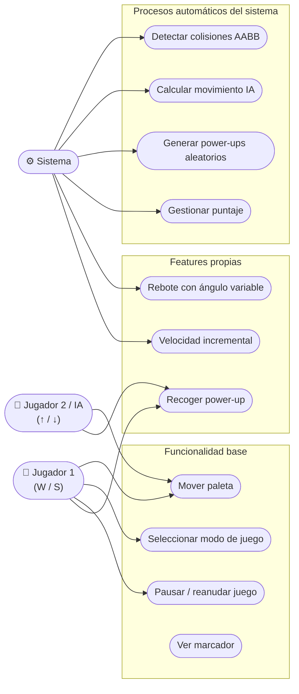
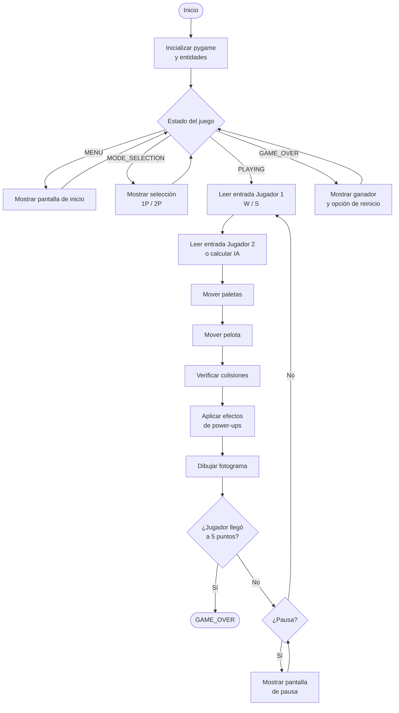
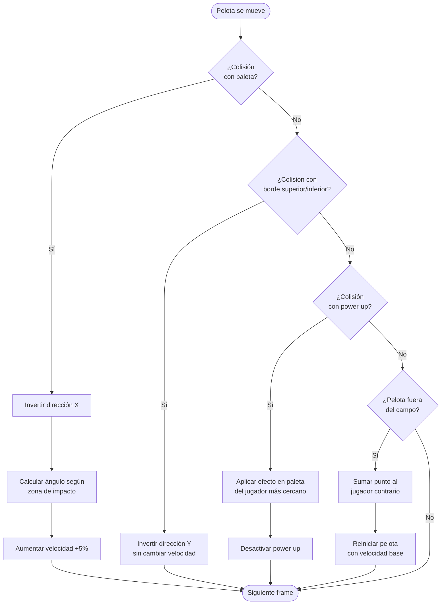
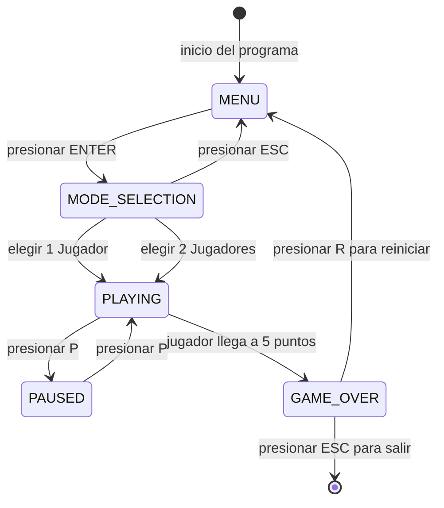
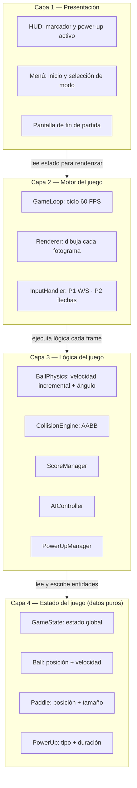

# Atari Pong — Versión Personalizada

Proyecto universitario — Universidad Internacional del Ecuador  
Materia: Arquitectura de Software  
Autor: Kevin Barré Espín · Quito, Mayo 2026

Reimplementación del Pong clásico en Python con cuatro funcionalidades propias, siguiendo una arquitectura limpia en capas con principios SOLID.

---

## Mecánicas base

| Pregunta | Decisión de diseño |
|---|---|
| Movimiento de la pelota | Vectores de velocidad X/Y que se modifican al colisionar |
| Detección de colisiones | AABB — Axis-Aligned Bounding Boxes |
| Inteligencia artificial | Sigue la posición Y de la pelota con velocidad limitada (vencible) |
| Fin de partida | Primer jugador que alcanza **5 puntos** |
| Controles 2 jugadores | Jugador 1: `W` / `S` — Jugador 2: `↑` / `↓` |

---

## Funcionalidades nuevas (no existen en el Pong original)

| # | Feature | Descripción |
|---|---|---|
| 1 | **Velocidad incremental** | La pelota aumenta su velocidad un **5 %** con cada rebote en paleta |
| 2 | **Sistema de power-ups** | Aparecen aleatoriamente en el campo; hacen **crecer o encoger** la paleta del jugador que los recoge |
| 3 | **Modo 2 jugadores local** | Mismo teclado, controles diferenciados por jugador |
| 4 | **Ángulo de rebote variable** | El ángulo de salida depende de la **zona de impacto** en la paleta |

---

## Diagramas

### 2.1 Diagrama de casos de uso



---

### 2.2 Diagrama de flujo — Ciclo principal del juego (60 FPS)



---

### 2.3 Diagrama de flujo — Colisiones de la pelota



---

### 2.4 Diagrama de actividad — Estados del juego



---

### 3. Diagrama de arquitectura en capas



> Las capas solo dependen hacia abajo. La Capa 4 no importa nada del resto del sistema.

---

## Requisitos

```
Python >= 3.11
pygame >= 2.5
```

## Instalación y ejecución

```bash
pip install pygame
python main.py
```

## Controles

| Acción | Jugador 1 | Jugador 2 |
|---|---|---|
| Mover arriba | `W` | `↑` |
| Mover abajo | `S` | `↓` |
| Pausar | `P` | `P` |
| Reiniciar (game over) | `R` | `R` |
| Salir | `ESC` | `ESC` |
